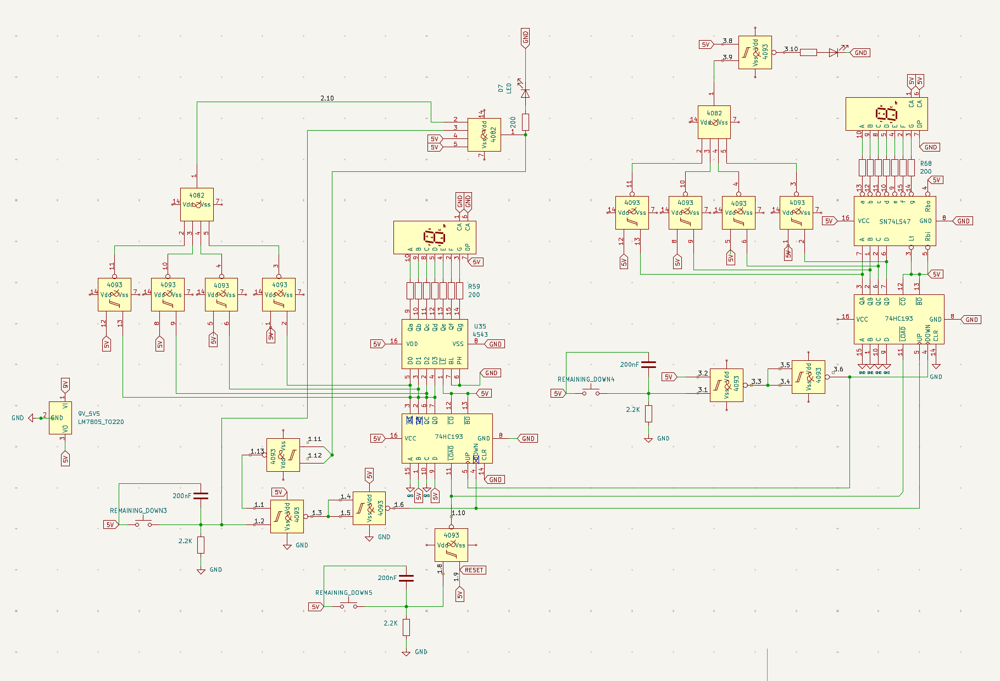

# Physical Implementation of a Garage Parking System

This repository contains the documentation, block diagrams, and schematic designs for a student project in **Digital Circuit Engineering** at the Technical University of Sofia, Plovdiv Branch.

## 👤 Author

* **Student:** Hristo Ganchev Nenkov


* **Group:** 41b group


* **Faculty Number:** 382583


* **Instructor / Evaluator:** Boris Ribov


---

## 📝 Project Overview

This project is a hardware prototype of an automated garage parking system designed for traffic control and parking space management. The system operates entirely at the hardware level using discrete logic gates (without microcontrollers). It processes input signals from entry/exit buttons to update counters and manage status indicators alongside 7-segment displays.

### Core Functionality:

* **Capacity & Counters:** The system tracks two key parameters:
* **AVAILABLE SPACES:** Initial value set to **6**. The display is designed to be placed at the entrance.


* **OCCUPIED SPACES:** Initial value set to **0**. The display is designed to be placed inside the security/guard room.


* **Button Operations:**
* `ENTER` (located outside): Pressing it upon entry decrements the *Available Spaces* counter by 1 and increments the *Occupied Spaces* counter by 1.


* `EXIT` (located inside): Pressing it upon exit increments the *Available Spaces* counter by 1 and decrements the *Occupied Spaces* counter by 1.


* `RESET / LOAD`: Reinitializes both counters to their default start values (6 available, 0 occupied).


* **Visual Indicators (LEDs):**
* 🔴 **Red LED:** Positioned under the *Available Spaces* display. Its default state is *OFF*. It turns *ON* when available spaces reach **0**, signaling that the parking lot is full.


* ⚪ **White LED:** Positioned in the center of the garage ceiling for illumination. Its default state is *ON*. It turns *OFF* when occupied spaces reach **0** since there are no cars left to illuminate.


* **Interlocking / Blocking Logic:** When the parking lot is full (*Available Spaces = 0*), the external `ENTER` button is automatically blocked to prevent false inputs. The internal `EXIT` button remains fully operational.


---

## 🛠️ Component Specification

### A) Power Supply

* **9V Battery** – Primary power source.


* **LM7805 TO-220** – Linear voltage regulator step-down to a stable +5V.


### B) Control & Signal Conditioning (Debouncing)

* **Tactile Push Button Switches** – For the Enter, Exit, and Reset triggers.


* **100nF / 200nF Capacitors** & **2.2kΩ Resistors** – Configured as RC low-pass filters.


* **IC 4093 (NAND Gate with Schmitt Trigger)** – Used for hardware debouncing to eliminate contact bounce and noise.


### C) Logic Gates & Counters

* **74HC193** – 4-bit binary up/down reversible counters.


* **IC 4093 (NAND)** & **IC 4082 (Dual 4-Input AND Gate)** – Configured to build the zero-detection (`0000`) and button-blocking combinatorial logic.


### D) Display Driver Section

* **CD4543B** – BCD to 7-segment decoder/driver (drives the *Available Spaces* display).


* **SN74LS47** – BCD to 7-segment decoder/driver (drives the *Occupied Spaces* display).


* **5161AS** – 7-segment display, **Common Anode** (for Available Spaces).


* **5161BS** – 7-segment display, **Common Cathode** (for Occupied Spaces).


* **220Ω Resistors** – Current-limiting pull-up/pull-down resistors for the display segments.


---

## 📐 Architecture & Schematics

### 1. Button Debounce Circuit

All three system buttons are hardware-stabilized using a parallel capacitor and a pull-down resistor (RC circuit). The signal passes through two inverting Schmitt triggers (4093 NAND gates with tied inputs) to output clean square pulses free of contact jitter.

### 2. System Block Diagram

```
                    [ 9V Battery ]
                          │
                  [ LM7805 (5V) ]
                          │
        ┌─────────────────┴─────────────────┐
  [ENTER Button]                      [EXIT Button]
        │                                   │
 [RC + Schmitt Filter]               [RC + Schmitt Filter]
        │                                   │
        ├─── Interlocking Logic             │
        ▼                                   ▼
 [Available Counter (74HC193)]       [Occupied Counter (74HC193)]
        │                                   │
 [Decoder CD4543B]                   [Decoder SN74LS47]
        │                                   │
 [7-Seg Common Anode]                [7-Seg Common Cathode]
        │                                   │
 [Zero-Detection Logic]              [Zero-Detection Logic]
        ▼                                   ▼
   🔴 Red LED                          ⚪ White LED

```

### 3. Complete Circuit Diagram

The underlying circuit schematic is mapped out according to strict TTL/CMOS logic voltage levels. Complex checking operations—such as preventing inputs when full and evaluating counter thresholds—rely on routing the binary counter outputs (`Qa, Qb, Qc, Qd`) through combinations of `4082` AND gates and `4093` NAND gates.


